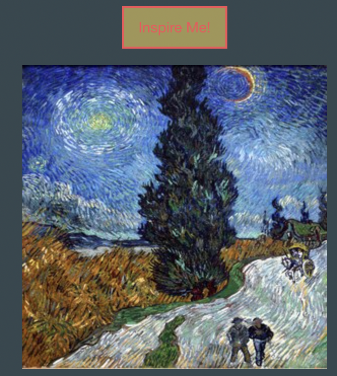

# DIY Paint-n-Sip

Group: HTeamL

```bash
- Newton Armstrong
- Asher Bergtraun
- Thomas Walker
```

## Description

DIY Paint-N-Sip brings the fun of Paint and Sip events into the comfort of your quarantined home! Users can learn how to make a new cocktail and get artistically inspired while enjoying their drink. The user selects their favorite liquor and gets a cocktail recipe that features their choice. Now, the user can click a button to replace that cocktail if they don’t like the first option. Afterwards, they can click a button to display a work of art from the Metropolitan Museum of Art’s exclusive collection and start painting!

Follow this link to check out:
[DIY Paint-n-Sip](https://twalker7.github.io/HTeamL-Project/)

## User Interface

The intitial page provides a dropdown menu, 2 buttons, and placeholders. 
The custom logo and color palette is designed to make the artwork pop!


If you are on mobile, the display has been customized for your convenience:


## User Interaction

Begin your evening by selecting your favorite liquor from the drop down menu:


Now press the "Drink Me!" button and get a custom cocktail recipe. If you want a new recipe click it again for a brand new option:


If you are ready to be inspired, press the "Inspire Me!" button:



It may take a minute to select the perfect piece of art for you!


When ready, your custom art selection will be presented:


## Behind the Curtain

For those of you interested in the behind the scenes details, the console will provide the cocktail ID numbers selected and the artwork ID numbers selected while searching for the perfect inspiration:


If there is any other information you would like displayed in the console, please contact the authors!

When you refresh your page, your latest cocktail and artwork selections are presented. This is due to the local storage updating and remembering your latest selection:


## Future Improvements

This is but the beginning!
Please see below a few future developments that will come soon:

```bash
- Source artwork from other museum collections
- Add user specified drink preferences (ie. non-alcoholic)
- Add food recipe options
- Return list of materials needed to execute artwork
- Replace artwork with a combination of inspirational images
- Add random color palette
- Play music to create ambience (select genre)
- Display image of finished cocktail
- Add scrollable boxes to contain recipe list to avoid text overflow
- Add social media link to share new drink and art with friends
- Include non-alcoholic options to welcome non-drinkers 
```
If you have any suggestions for improvements, please do not hesitate to contact the authors!

## Authors

```bash
- Newton Armstrong
- Asher Bergtraun
- Thomas Walker
```
